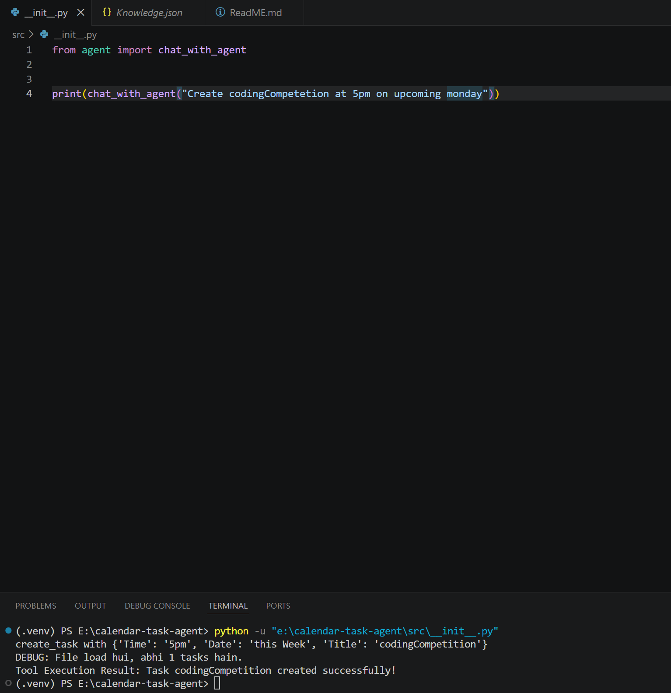
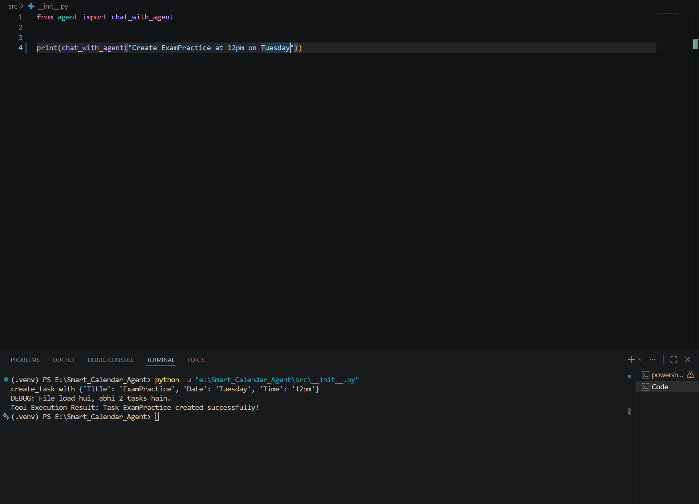

<p align="center">
  
</p>


# 🤖 AI Calendar Task Agent

A local AI-powered Calendar Task Agent built with **Python**, **Ollama (Llama 3.1)**, and **OpenAI Function Calling**.

This project allows users to manage calendar tasks using natural language. Instead of writing traditional commands, users can simply type prompts like:

> "Create a task to study at 9 PM today"

The LLM understands the request, selects the appropriate tool, executes it, and stores the task in persistent storage.

---

## ✨ Features

- 📝 Create tasks using natural language
- ✏️ Update existing tasks
- 🗑️ Delete tasks
- 📋 Display all tasks
- 🔍 Find tasks by title
- 📅 Automatic date normalization
  - Today
  - Tomorrow
  - Next Wednesday
  - 2026-07-15
- ⏰ Automatic time normalization
  - 9 pm
  - 18:30
  - 7:15 AM
- 💾 Persistent JSON storage
- 🔧 Tool Calling using OpenAI-compatible API
- 🖥️ Runs completely locally using Ollama

---

# 🛠 Tech Stack

- Python
- Ollama
- Llama 3.1
- OpenAI Python SDK
- python-dateutil
- JSON
- dotenv

---

# 📂 Project Structure

```
CalendarTaskAgent/
│
├── src/
│   ├── agent.py
│   ├── tools.py
│   ├── __init__.py
│
├── Knowledge.json
├── .env.example
├── requirements.txt
├── README.md
└── screenshots/
```

---

# ⚙️ Installation

## Clone Repository

```bash
git clone https://github.com/NavneetKumar-GS/SmartCalenderAgent.git

cd CalendarTaskAgent
```

---

## Create Virtual Environment

Windows

```bash
python -m venv .venv

.venv\Scripts\activate
```

Linux / Mac

```bash
python3 -m venv .venv

source .venv/bin/activate
```

---

## Install Dependencies

```bash
pip install -r requirements.txt
```

---

## Install Ollama

Download Ollama from

https://ollama.com

Pull the model

```bash
ollama pull llama3.1
```

Start Ollama

```bash
ollama serve
```

---

## Configure Environment

Create a `.env`

```
OLLAMA_BASE_URL=http://localhost:11434/v1
OLLAMA_API_KEY=ollama
MODEL_NAME=llama3.1
```

---

# ▶️ Run

```bash
python src/__init__.py
```

or

```bash
python main.py
```

---

# 💬 Example Prompts

### Create Task

```
Create task Study at 9 PM today
```

---

### Update Task

```
Change Study to Gym tomorrow at 6 PM
```

---

### Delete Task

```
Delete Study
```

---

### Show Tasks

```
Show all tasks
```

---

# 📸 Demo

## Create Task

<p align="center">
  
  
</p>

---


# 📁 Example JSON Storage

```json
{
    "tasks": [
        {
            "id": 1,
            "Title": "Study",
            "Date": "2026-07-07",
            "Time": "09:00 PM",
            "Created_at": "2026-07-06 18:12:19"
        }
    ]
}
```

---

# 🧠 How It Works

1. User enters a natural language prompt.
2. Llama 3.1 understands the intent.
3. The model selects the appropriate tool.
4. Python executes the corresponding function.
5. Date and time are normalized.
6. Task is stored inside `Knowledge.json`.
7. A success response is returned to the user.

---

# 🚀 Future Improvements

- SQLite / PostgreSQL integration
- Google Calendar integration
- Multi-user support
- FastAPI backend
- Streamlit UI
- Voice commands
- Reminder notifications
- Docker support

---

# 📌 Learning Outcomes

This project helped me understand:

- LLM Function Calling
- Agent Architecture
- Tool Execution
- Prompt Engineering
- JSON Persistence
- Date & Time Parsing
- Building Local AI Applications using Ollama

---

# 🤝 Contributing

Contributions, issues, and feature requests are welcome.

Feel free to fork this repository and submit a pull request.

---


# 👨‍💻 Author

**Navneet Kumar**

LinkedIn:
in.linkedin.com/in/navneet-kumar-9a8230345?original_referer=https%3A%2F%2Fwww.google.com%2F

GitHub:
https://github.com/NavneetKumar-GS